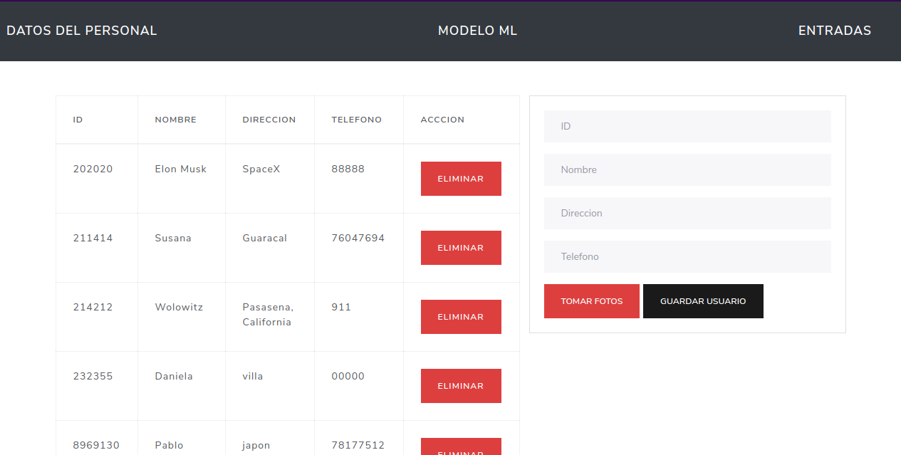

# Facial Recognition System and MySQL DB V1 with OpenCV and ML5.js

_Sistema de Reconocimiento Facial para realizar su registro de Dia y Hora, y almacenar estos datos en una base de datos MySQL_

## Introducción

_Este proyecto fue propuesto como trabajo para la materia de TALLER DE ANÁLISIS Y DISEÑO DE REDES llevada en la carrera de INGENIERIA DE REDES Y TELECOMUNICACIONES._

_Objetivo: Diseñar e implementar un sistema basado en reconocimiento facial donde se guardarán diversos datos en una base de datos MySQL, estos se obtendrán al momento que se registre una nueva entrada de un usuario en el sistema._

## General

_Esta es la primera version realizada del proyecto, donde se quieren hacer pruebas usando Python con OpenCV para la deteccion de rostros y ML5 para el reconocimiento y clasificacion de imagenes_

## Requerimientos 📋

_Para poder usar esta version del proyecto debe asegurarte que en su pc tengas instalado Python 3 junto con las siguientes librerias:_

_* opencv_
_* opencv-contrib-python_

_Tambien debe tener la base de datos MySQL creada, puede usar las instrucciones que estan el archivo "personal.sql" dentro de la carpeta llamada "database" en este repositorio_

_- Luego ejecutar el comando:_

```
npm start
```

## Indicaciones 

# Vista interfaz para Agregar o Eliminar Usuarios Comunes



# Vista interfaz para Actualizar el Modelo de Reconocimiento


# Vista de interfaz para registro de las entradas


_Aquí es donde se capturan los datos de la hora y día, luego que el sistema de reconocimiento logre identificar satisfactoriamente al usuario._


## Aclaraciones

_Esta version del proyecto quedo relegada, ya que se vio mejores resultados usando Face.API para el reconocimiento de rostros, puede revisar la otra version aqui https://github.com/IlusionistaXD/proyectoTaller_


## Construido con 🛠️
* [OpenCV](https://opencv.org/)
* [ML5.js](https://ml5js.org/) - Una forma sencilla de usar Tensorflow.js
